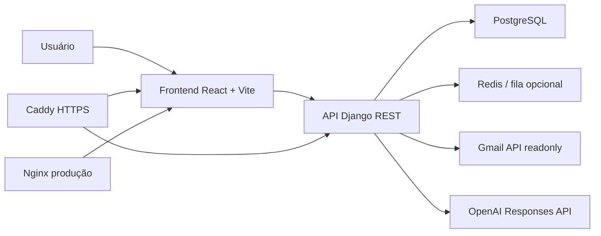

# Email Radar / MailGuard AI


Plataforma full-stack de segurança para Gmail que sincroniza mensagens com acesso somente leitura, classifica riscos de phishing/spam/golpes com IA e exibe uma explicação clara para o usuário antes que ele clique em algo perigoso.

Este repositório foi preparado como projeto público de portfólio: ele demonstra arquitetura real, integração com APIs externas, cuidado com privacidade, conteinerização, fallback local de IA e uma interface moderna orientada a produto.

## O Que Chama Atenção

- **Produto completo, não apenas CRUD:** o sistema resolve um problema real de segurança, com fluxo OAuth, sincronização Gmail, análise de risco, painel visual e ações do usuário.
- **Segurança como requisito de arquitetura:** segredos ficam no backend, tokens OAuth são criptografados em repouso e o frontend nunca recebe chaves do Google ou da OpenAI.
- **IA com fallback confiável:** quando a API de IA falha, não há tela quebrada; o backend usa heurísticas locais para manter uma classificação preliminar.
- **Experiência de avaliação simples:** o frontend suporta modo mock para demonstração visual sem conectar uma conta real.
- **Deploy pensado para produção:** stack com Django, React/Vite, PostgreSQL, Redis, Nginx e Caddy com HTTPS automatizado.

## Principais Funcionalidades

- Login com Google OAuth usando apenas o escopo `gmail.readonly`.
- Sincronização de mensagens da caixa de entrada e spam.
- Classificação de risco em quatro níveis: confiável, levemente confiável, suspeito e perigoso.
- Pontuação de risco de 0 a 100 com justificativa em português.
- Análise de phishing, spam, golpes, spoofing, malware, anexos perigosos, links e inconsistências de domínio.
- Lista paginada de emails com busca por remetente, assunto, resumo e corpo.
- Painel de leitura com explicação da IA e sinais detectados.
- Regras de remetente ou domínio confiável para reduzir falsos positivos.
- Revogação de token OAuth e exclusão dos dados locais da conta.
- Fila opcional com Redis para processamento assíncrono de análises.
- Configuração de beta fechada com Basic Auth, CORS/CSRF e cookies seguros.

## Arquitetura



## Stack Técnica

- **Backend:** Django, Django REST Framework, PostgreSQL, Redis, Cryptography/Fernet.
- **Frontend:** React, TypeScript, Vite, TanStack Router, TanStack Query, Zustand, Radix UI, Lucide, Tailwind CSS.
- **IA:** OpenAI Responses API com JSON Schema estrito e fallback heurístico local.
- **Integrações:** Google OAuth 2.0 e Gmail API com acesso somente leitura.
- **Infra:** Docker Compose, Caddy como proxy reverso, Nginx para servir o frontend em produção.

## Estrutura do Projeto

```text
backend/                         API Django, modelos, serviços e segurança
frontend/mailguard-ai-dashboard/ Frontend React/TypeScript
caddy/                           Proxy reverso público para produção
docs/                            Guias de OAuth, deploy e revisão de segurança
docker-compose.yml               Ambiente local
docker-compose.prod.yml          Stack de produção
.env.example                     Variáveis locais sem segredos reais
.env.production.example          Template de produção sem segredos reais
```

## Como Rodar em Modo Demonstração

Para avaliar rapidamente a interface sem Gmail real, use o modo mock do frontend.

```bash
cd frontend/mailguard-ai-dashboard
npm install
VITE_USE_MOCKS=true npm run dev
```

O painel ficará disponível no endereço mostrado pelo Vite. Nesse modo, a UI usa emails fictícios e permite observar fluxos de lista, busca, resumo, preview e classificação de risco.

## Como Rodar com Backend Real

1. Copie o arquivo de exemplo:

```bash
cp .env.example .env
```

2. Configure as variáveis necessárias:

```env
GOOGLE_CLIENT_ID=...
GOOGLE_CLIENT_SECRET=...
GOOGLE_OAUTH_REDIRECT_URI=http://localhost:8000/api/auth/google/callback/
OPENAI_API_KEY=...
```

3. Suba a stack local:

```bash
docker compose up --build
```

4. Acesse:

```text
Frontend: http://localhost:8080
Backend healthcheck: http://localhost:8000/api/healthz/
```

Sem `OPENAI_API_KEY`, o backend continua funcionando com classificação heurística local.

## Decisões de Segurança

- O frontend chama apenas a API do backend; ele não possui segredos de Gmail ou OpenAI.
- Tokens de acesso e refresh do Google são persistidos no backend e criptografados com `GOOGLE_TOKEN_ENCRYPTION_KEY` quando configurado.
- O payload enviado para IA é reduzido: remetente, domínio, assunto e texto legível limitado.
- URLs brutas são removidas do corpo antes da análise por IA para reduzir ruído e exposição desnecessária.
- Em produção, `DEBUG=false` exige `SECRET_KEY`, `ALLOWED_HOSTS`, `POSTGRES_PASSWORD` e chave de criptografia.
- A cópia pública remove arquivos locais de ambiente, histórico Git e artefatos gerados.

Leia também: [PUBLICATION_SECURITY_REVIEW.md](PUBLICATION_SECURITY_REVIEW.md).

## Pontos para Avaliadores

- [backend/api/services/gmail.py](backend/api/services/gmail.py): fluxo OAuth, leitura Gmail, parse de mensagens, links, anexos e cabeçalhos.
- [backend/api/services/openai_analysis.py](backend/api/services/openai_analysis.py): prompt de segurança, JSON Schema, retry, fallback local e normalização da resposta.
- [backend/api/fields.py](backend/api/fields.py): campo customizado para criptografia transparente de tokens.
- [backend/api/views.py](backend/api/views.py): endpoints de sincronização, análise, resumo, revogação OAuth e regras de confiança.
- [frontend/mailguard-ai-dashboard/src/features](frontend/mailguard-ai-dashboard/src/features): organização por funcionalidades no frontend.
- [docs/google-oauth-verification-launch.md](docs/google-oauth-verification-launch.md): preparação para verificação OAuth do Google.

## Roadmap

- Autenticação própria por usuário além da beta fechada.
- Políticas de ownership para múltiplas contas e equipes.
- Observabilidade com métricas de análise, latência e falhas externas.
- Testes end-to-end do fluxo Gmail/OAuth em ambiente de staging.
- Painel administrativo para regras globais de confiança e bloqueio.

---

Projeto criado para demonstrar capacidade full-stack aplicada a segurança, IA, privacidade, arquitetura de produto e preparo para produção.
